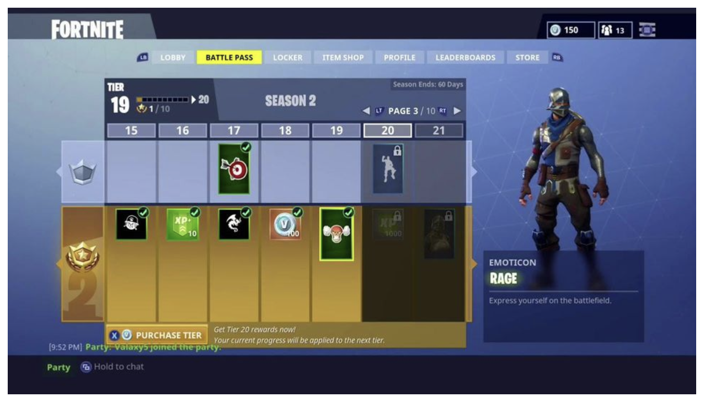
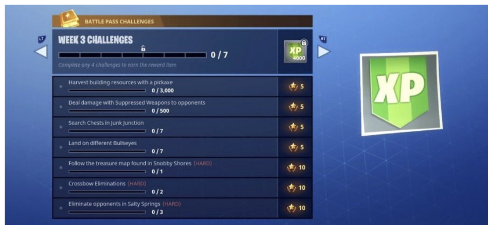
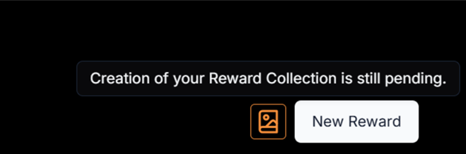
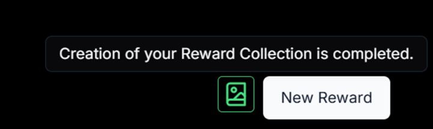
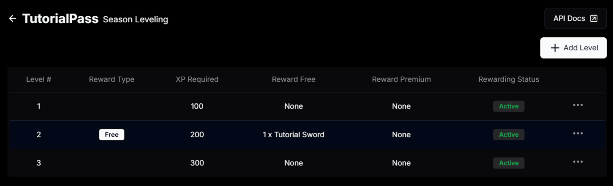
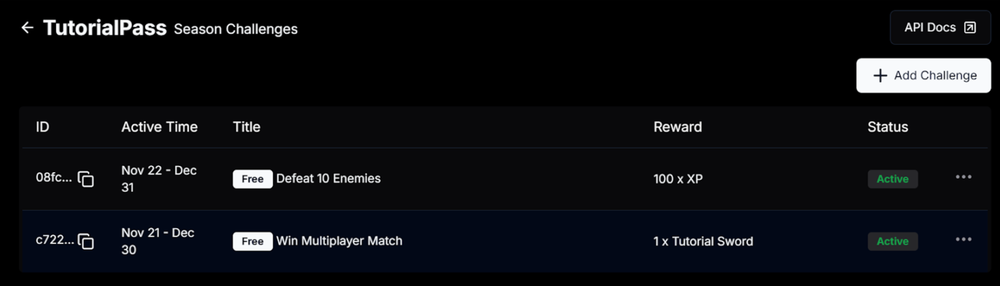
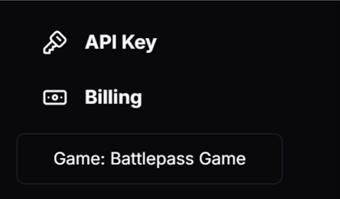
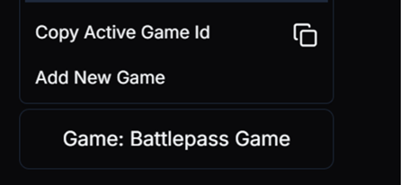

# Whalepass Tutorial

Welcome to the Whalepass tutorial! This guide will help you set up and manage your battle pass to enhance player engagement and retention.
You can find the Insomnia Rest Collection [here](https://github.com/whalepass/documentation/blob/master/insomnia/whalepass_api_insomnia.json)
Download it and import to Insomnia on your local environment and then update the environment variables of collection.

---

## Purpose of This Tutorial

This tutorial aims to assist developers in creating and customizing battle passes using Whalepass. It covers:

- Configuring tiers and rewards.
- Integrating battlepass seamlessly into your game.

---

## 1. What is a Battlepass?

A battlepass is a progression system used in games to reward players for completing specific challenges or activities. It typically includes:

### Key Features

- **Tiers or Levels**  
  Players progress through tiers by earning points or XP.  
  Each tier unlocks rewards such as in-game items, currency, or exclusive content.

- **Time-Limited Access**  
  Battle passes are often available for a specific season or event.  
  This encourages players to engage consistently within a set timeframe.

- **Rewards System**  
  Rewards are divided into free and premium tracks.  
  The premium track requires a purchase to unlock additional rewards.

Fortnite Battlepass Level/Challenge Examples:

### Benefits for Developers

For developers, a battle pass is a powerful tool to:

- Increase player engagement.
- Improve player retention.
- Boost monetization by incentivizing players to participate actively over time.

---

## 2. What is Whalepass?

Whalepass is a platform that helps developers create, manage, and integrate battlepasses seamlessly into their games.

### How Whalepass Helps Developers

- **Design Custom Battle Passes**  
  Define tiers, rewards, and challenges tailored to your game's needs.

- **Streamline Integration**  
  Use Whalepass tools and APIs to connect your battle pass system directly to your game.

- **Track Engagement**  
  Monitor player progression and reward distribution through an intuitive dashboard.

### Why Choose Whalepass?

Whalepass enables developers to focus on enhancing player engagement without worrying about the complexities of building and maintaining a battle pass system from scratch.

---

## 3. How to Use Whalepass?

### Setting Up Whalepass Developer Account

To get started with Whalepass and create your first battlepass:

1. **Sign Up**  
   Visit [dashboard.whalepass.gg](https://dashboard.whalepass.gg) to sign up. This dashboard is your central hub for:

   - Designing, managing, and tracking battle passes.
   - Accessing the Whalepass API for seamless integration into your game.

2. **Dashboard Features**  
   Once you've signed up and logged in, you’ll have access to the following features:
   - **Battle Passes**: View and manage all your created battle passes, including their tiers, challenges, and rewards.
   - **Rewards**: Create and manage in-game items, currencies, and external rewards, such as cryptocurrencies.
   - **Players**: Track player activity and progression within your battle passes, helping you understand player engagement.
   - **Analytics**: Gain insights into how players interact with your battle pass, including:
     - Completion rates.
     - Challenges completed.
     - Reward redemption.

This centralized view makes it easy to manage your battle passes and optimize the player experience.

---

## 4. Setting Up Your Rewards

For this tutorial, we will create our rewards on the **Moonbeam Chain**! Follow these steps to create on-chain rewards in the Whalepass Dashboard:

### Step 1: Create an Onchain Reward Collection

1. Navigate to the Rewards section of the dashboard at [dashboard.whalepass.gg/rewards](https://dashboard.whalepass.gg/rewards).
2. Click on the `Create New Reward/Onchain Reward` button.
3. Fill in the following details:
   - Collection Name: Give your collection a name (e.g., "BlackKnights").
   - Collection Image: Upload an image that represents your collection.
   - Description: Add a description to explain what this collection represents.
   - Symbol: Set a symbol for the collection (e.g., "BK").
   - Chain: Select Moonbeam as the chain for your on-chain rewards.
4. Once done, click Save to create your collection. You will have the below indicator for your on-chain reward collection

5. Wait until the status of the reward collection changes to complete.

**Tip**: You may need to refresh your dashboard until the collection status changes to complete.

### Step 2: Create Onchain Rewards

1. Inside your collection, click `Create New Reward`.
2. Set up the reward details:
   - Define what the reward is.
   - Attach any visuals or other necessary details.
3. Save your reward.

These rewards are now ready to be traded or gifted on the marketplace.

---

## 5. How to Set Up a Battlepass Campaign

### Step 1: Create a New Campaign

1. Navigate to the Campaigns section in the Whalepass Dashboard.
2. Click `Create New Campaign`.
3. Provide the following details:
   - Campaign Name: Give your campaign a unique name.
   - Duration: Define the start and end dates for the campaign.

### Step 2: Set Levels for XP Progression

1. Define levels for XP progression.
2. Players will:
   - Earn XP through in-game activities.
   - Progress through levels to unlock rewards.
  

### Step 3: Add Challenges

Challenges are single-time objectives that players can complete to earn rewards. They are:

- Independent of level progression.
- Tied to specific in-game actions or milestones (e.g., "Complete 10 matches" or "Achieve a certain score").

---

# How to Start Implementation

This guide explains how to integrate with the Whalepass API by making authenticated requests using your API key and Battlepass ID.

---

## Step-by-Step Guide to Calling the API

### Step 1: Retrieve Your API Key

1. Go to [https://dashboard.whalepass.gg/api-key](https://dashboard.whalepass.gg/api-key).
2. Copy your **Server Key** (API Key).

### Step 2: Retrieve Your Battlepass ID

1. Navigate to [https://dashboard.whalepass.gg/campaigns](https://dashboard.whalepass.gg/campaigns).
2. Find your campaign (e.g., "Unity Battlepass").
3. Copy the **Battlepass ID**.

### Step 3: Make the API Request

When making API calls, include the following headers in your request:

- **X-API-KEY**: Your Server Key (API Key from Step 1).
- **X-Battlepass-Id**: Your Battlepass ID (from Step 2).

---

## How to Find Your IDs

### Finding Your Game ID

1. Log in to your Whalepass Dashboard.
2. Locate the **Game Section** in the lower-left corner (e.g., "Game: Battlepass Game").
   
4. Click the displayed game name to open additional options.
5. Find the option labeled **Copy Active Game ID** and click the copy icon.

   
6. Use the copied Game ID in your API integrations.

### Finding Your Game Action ID

1. Navigate to the [Game Actions Page](https://dashboard-staging.whalepass.gg/game-actions).
2. Look for the specific Game Action you need.
3. Copy the **Game Action ID** listed next to each Game Action.

### Finding Your Challenge ID

1. Go to the [Campaigns Page](https://dashboard-staging.whalepass.gg/campaigns).
2. Select your campaign and navigate to the **Setup Challenges** section.
3. Locate the challenge you need and copy its **Challenge ID**.

---

## Key API Endpoints

### 1. Enrolling Players via API

**Endpoint**: [Enrollment Api Endpoint](https://www.whalepass.gg/documentation/enrollment).
To enroll a player in your Battlepass:

- Send the player's **playerId** and **gameId**.
- **Idempotency**: Repeated requests with the same playerId will not create duplicates.

---

### 2. Incrementing XP for Player Progression

Players progress in their Battlepass by earning XP. Two methods are available:

#### Method 1: Directly Increment XP (Hardcode Method)

- Use the API to manually add XP to a player's account.
- **Endpoint**: [XP Hardcode API Documentation](https://www.whalepass.gg/documentation/exp_hardcode).

#### Method 2: Assign XP via Game Actions (Softcode Method)

- Create specific in-game actions to dynamically reward XP. Examples:
  - Completing a level.
  - Defeating a boss.
  - Achieving a milestone.
- **Endpoint**: [XP Softcode API Documentation](https://www.whalepass.gg/documentation/exp_softcode).

---

### 3. Completing Challenges for Players

**Endpoint**: [Player Challenge API Documentation](https://www.whalepass.gg/documentation/player_challenge)  
Mark challenges as completed by sending:

- **playerId**: The ID of the player.
- **challengeId**: The ID of the challenge.

This updates the player's progress and rewards them.

---

### 4. Getting Player Progress

Retrieve detailed information about a player's current progress in their Battlepass:

- **Endpoint**: [Get Player Progress API Documentation](https://www.whalepass.gg/documentation/get_player_progress).

What you can retrieve:
- Overall progress toward completing the Battlepass.
- Levels and their unlock status.
- Challenges and their completion status.

#### Alternative: Basic Player Progress

- Use a simplified API for core progress details (e.g., no levels or challenges).  
  - **Endpoint**: [Get Player Progress Base API Documentation](https://www.whalepass.gg/documentation/get_player_progress_base).

---

### 5. Getting Player Inventory

List rewards and items a player has earned through their Battlepass progress:

- **Endpoint**: [Get Player Inventory API Documentation](https://www.whalepass.gg/documentation/get_player_inventory).

What you can retrieve:
- Items earned from completed levels.
- Rewards from challenges.

---

### 6. Redirecting Players to Discover.Games

Redirect players to manage their on-chain rewards and explore other games:

- **Endpoint**: [Redirect Player API Documentation](https://www.whalepass.gg/documentation/redirect_player).

**Important Note**:  
- Each link is user-specific and expires after a set time.
- Generate a new link each time for a secure and fresh session.

Once redirected, players can view and manage their on-chain rewards at:  
[Discover Games - My Rewards](https://discover.games).
